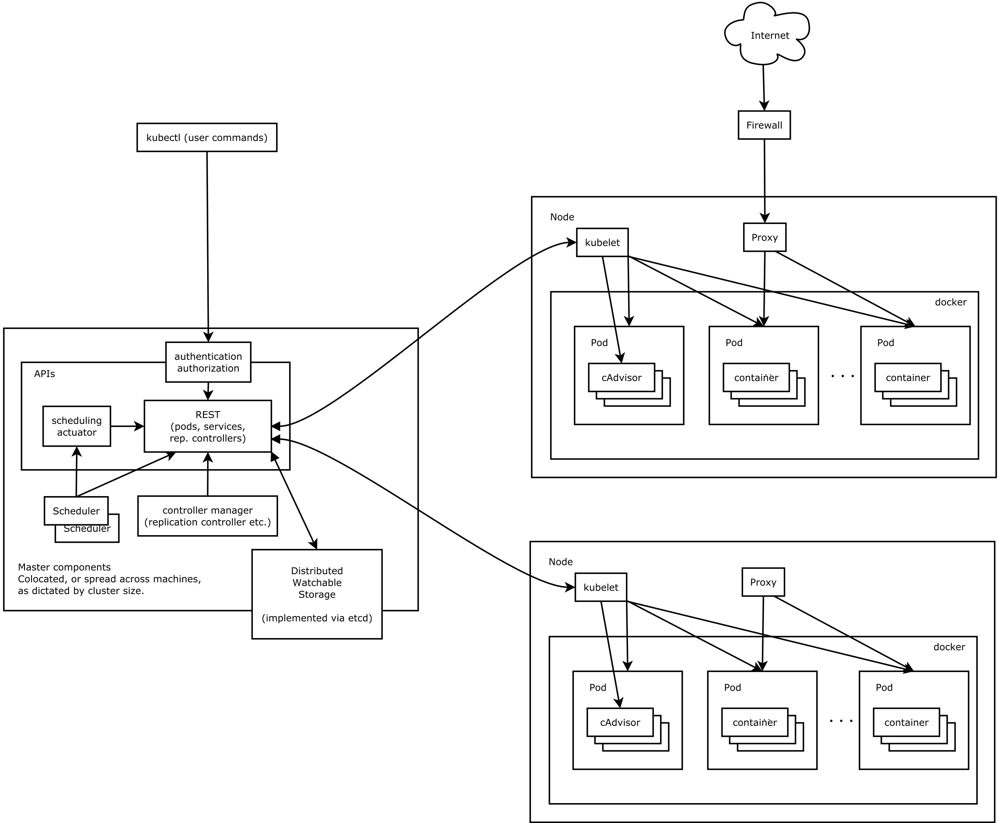

# kubernetes
## 什么是kubernetes
Kubernetes(k8s)是Google开源的容器集群管理系统（谷歌内部:Borg）。在Docker技术的基础上，为容器化的应用提供部署运行、资源调度、服务发现和动态伸缩等一系列完整功能，提高了大规模容器集群管理的便捷性。

#### Kubernetes的核心概念
    1.Pod
    运行于Node节点上，若干相关容器的组合。Pod内包含的容器运行在同一宿主机上，使用相同的网络命名空间、IP地址和端口，能够通过localhost进行通。Pod是Kurbernetes进行创建、调度和管理的最小单位，它提供了比容器更高层次的抽象，使得部署和管理更加灵活。一个Pod可以包含一个容器或者多个相关容器。
    2.Replication Controller
    Replication Controller用来管理Pod的副本，保证集群中存在指定数量的Pod副本。集群中副本的数量大于指定数量，则会停止指定数量之外的多余容器数量，反之，则会启动少于指定数量个数的容器，保证数量不变。Replication Controller是实现弹性伸缩、动态扩容和滚动升级的核心。
    3.Service
    Service定义了Pod的逻辑集合和访问该集合的策略，是真实服务的抽象。Service提供了一个统一的服务访问入口以及服务代理和发现机制，用户不需要了解后台Pod是如何运行。
    4.Label
    Kubernetes中的任意API对象都是通过Label进行标识，Label的实质是一系列的K/V键值对。Label是Replication Controller和Service运行的基础，二者通过Label来进行关联Node上运行的Pod。
    5.Node
    Node是Kubernetes集群架构中运行Pod的服务节点（亦叫agent或minion）。Node是Kubernetes集群操作的单元，用来承载被分配Pod的运行，是Pod运行的宿主机。
   [更多](kubernetes-yaml.md)
#### Kubernetes组件
> Kubernetes Master控制组件，调度管理整个系统（集群），包含如下组件:

    1.Kubernetes API Server
    作为Kubernetes系统的入口，其封装了核心对象的增删改查操作，以RESTful API接口方式提供给外部客户和内部组件调用。维护的REST对象持久化到Etcd中存储
    2.Kubernetes Scheduler
    为新建立的Pod进行节点(node)选择(即分配机器)，负责集群的资源调度。组件抽离，可以方便替换成其他调度器。
    3.Kubernetes Controller
    负责执行各种控制器，目前已经提供了很多控制器来保证Kubernetes的正常运行。
        - Replication Controller
        管理维护Replication Controller，关联Replication Controller和Pod，保证Replication Controller定义的副本数量与实际运行Pod数量一致
        - Node Controller
        管理维护Node，定期检查Node的健康状态，标识出(失效|未失效)的Node节点。
        - Namespace Controller
        管理维护Namespace，定期清理无效的Namespace，包括Namesapce下的API对象，比如Pod、Service等。
        - Service Controller
        管理维护Service，提供负载以及服务代理。
        - EndPoints Controller
        管理维护Endpoints，关联Service和Pod，创建Endpoints为Service的后端，当Pod发生变化时，实时更新Endpoints
        - Service Account Controller
        管理维护Service Account，为每个Namespace创建默认的Service Account，同时为Service Account创建Service Account Secret
        - Persistent Volume Controller
        管理维护Persistent Volume和Persistent Volume Claim，为新的Persistent Volume Claim分配Persistent Volume进行绑定，为释放的Persistent Volume执行清理回收
        - Daemon Set Controller
        管理维护Daemon Set，负责创建Daemon Pod，保证指定的Node上正常的运行Daemon Pod。
        - Deployment Controller
        管理维护Deployment，关联Deployment和Replication Controller，保证运行指定数量的Pod。当Deployment更新时，控制实现Replication Controller和　Pod的更新 。
        - Job Controller
        管理维护Job，为Jod创建一次性任务Pod，保证完成Job指定完成的任务数目
        - Pod Autoscaler Controller
        实现Pod的自动伸缩，定时获取监控数据，进行策略匹配，当满足条件时执行Pod的伸缩动作。

> Kubernetes Node运行节点，运行管理业务容器，包含如下组件:

    1.Kubelet
    负责管控容器，Kubelet会从Kubernetes API Server接收Pod的创建请求，启动和停止容器，监控容器运行状态并汇报给Kubernetes API Server
    2.Kubernetes Proxy
    负责为Pod创建代理服务，Kubernetes Proxy会从Kubernetes API Server获取所有的Service信息，并根据Service的信息创建代理服务，实现Service到Pod的请求路由和转发，从而实现Kubernetes层级的虚拟转发网络。
    3.Docker
    Node上需要运行容器服务。
## 架构:
 


## kubernetes的认证授权

Kubernetes集群的所有操作基本上都是通过kube-apiserver这个组件进行的，它提供HTTP RESTful形式的API供集群内外客户端调用。需要注意的是：认证授权过程只存在HTTPS形式的API中。也就是说，如果客户端使用HTTP连接到kube-apiserver，那么是不会进行认证授权的。所以说，可以这么设置，在集群内部组件间通信使用HTTP，集群外部就使用HTTPS，这样既增加了安全性，也不至于太复杂。
对APIServer的访问要经过的三个步骤，前面两个是认证和授权，第三个是 Admission Control，它也能在一定程度上提高安全性，不过更多是资源管理方面的作用。

#### 1. kubernetes的认证
> kubernetes提供了多种认证方式，比如客户端证书、静态token、静态密码文件、ServiceAccountTokens等等。你可以同时使用一种或多种认证方式。只要通过任何一个都被认作是认证通过。下面我们就认识几个常见的认证方式。

```
- 客户端证书认证
    客户端证书认证叫作TLS双向认证，也就是服务器客户端互相验证证书的正确性，在都正确的情况下协调通信加密方案。
    为了使用这个方案，api-server需要用–client-ca-file选项来开启。
- 引导Token
    当我们有非常多的node节点时，手动为每个node节点配置TLS认证比较麻烦，这时就可以用到引导token的认证方式，前提是需要在api-server开启 experimental-bootstrap-token-auth 特性，客户端的token信息与预先定义的token匹配认证通过后，自动为node颁发证书。当然引导token是一种机制，可以用到各种场景中。
- Service Account Tokens 认证
    有些情况下，我们希望在pod内部访问api-server，获取集群的信息，甚至对集群进行改动。针对这种情况，kubernetes提供了一种特殊的认证方式：Service Account。 Service Account 和 pod、service、deployment 一样是 kubernetes 集群中的一种资源，用户也可以创建自己的 Service Account。
    ServiceAccount 主要包含了三个内容：namespace、Token 和 CA。namespace 指定了 pod 所在的 namespace，CA 用于验证 apiserver 的证书，token 用作身份验证。它们都通过 mount 的方式保存在 pod 的文件系统中。
```
#### 2. kubernetes的授权

```
在Kubernetes1.6版本中新增角色访问控制机制（Role-Based Access，RBAC）让集群管理员可以针对特定使用者或服务账号的角色，进行更精确的资源访问控制。在RBAC中，权限与角色相关联，用户通过成为适当角色的成员而得到这些角色的权限。这就极大地简化了权限的管理。在一个组织中，角色是为了完成各种工作而创造，用户则依据它的责任和资格来被指派相应的角色，用户可以很容易地从一个角色被指派到另一个角色。
目前 Kubernetes 中有一系列的鉴权机制，因为Kubernetes社区的投入和偏好，相对于其它鉴权机制而言，RBAC是更好的选择。
```

#### 3. kubernetes的AdmissionControl
```
AdmissionControl – 准入控制本质上为一段准入代码，在对kubernetes api的请求过程中，顺序为：先经过认证 & 授权，然后执行准入操作，最后对目标对象进行操作。这个准入代码在api-server中，而且必须被编译到二进制文件中才能被执行。
在对集群进行请求时，每个准入控制代码都按照一定顺序执行。如果有一个准入控制拒绝了此次请求，那么整个请求的结果将会立即返回，并提示用户相应的error信息。
常用组件（控制代码）如下：

AlwaysAdmit：允许所有请求
AlwaysDeny：禁止所有请求，多用于测试环境
ServiceAccount：它将serviceAccounts实现了自动化，它会辅助serviceAccount做一些事情，比如如果pod没有serviceAccount属性，它会自动添加一个default，并确保pod的serviceAccount始终存在
LimitRanger：他会观察所有的请求，确保没有违反已经定义好的约束条件，这些条件定义在namespace中LimitRange对象中。如果在kubernetes中使用LimitRange对象，则必须使用这个插件。
NamespaceExists：它会观察所有的请求，如果请求尝试创建一个不存在的namespace，则这个请求被拒绝。
```

## [k8s部署](k8s-install.md)
 

## fabric8 api

#### 1、引入依赖包

```
    <dependency>
		<groupId>io.fabric8</groupId>
		<artifactId>kubernetes-client</artifactId>
		<version>2.6.3</version>
	</dependency>
	<dependency>
		<groupId>com.google.code.gson</groupId>
		<artifactId>gson</artifactId>
		<version>2.4</version>
	</dependency>
	<dependency>
		<groupId>com.alibaba</groupId>
		<artifactId>fastjson</artifactId>
		<version>1.2.3</version>
	</dependency>
```

#### 2、创建访问客户端
```
        Config config = new ConfigBuilder().withMasterUrl("https://192.168.70.138:6443/")
                .withUsername("admin").withPassword("123456")
            //    .withNamespace("demo")
                .withTrustCerts(true).build();
        KubernetesClient client = new DefaultKubernetesClient(config);
```

#### 3、通过client进行crud
 
```
        List<Namespace> nameSpaceList =client.namespaces().list().getItems();//查询所有的namespaces列表
        for(Namespace ns: nameSpaceList){
            System.out.println("namespace >"+ns.getMetadata().getName());//输出所有的namespace name
        }
```

## pv & pvc 示例
> https://kubernetes.io/docs/user-guide/persistent-volumes/walkthrough/

